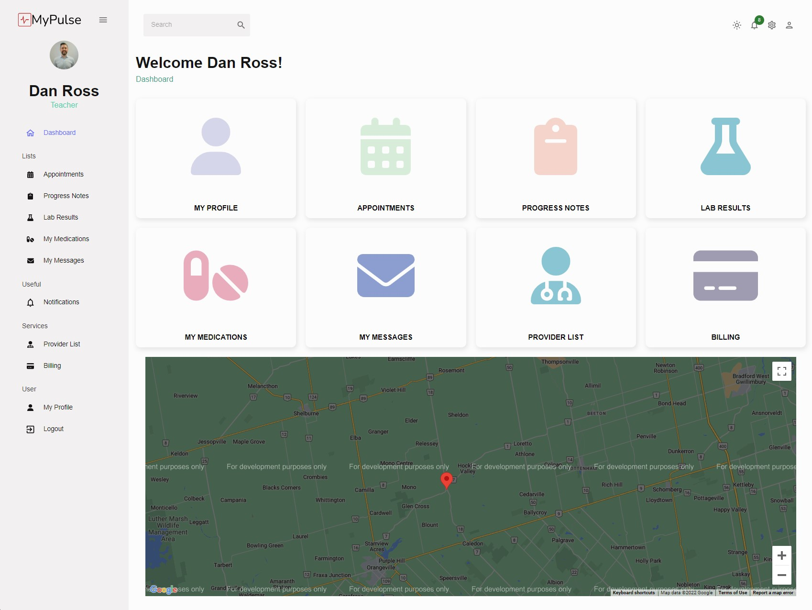
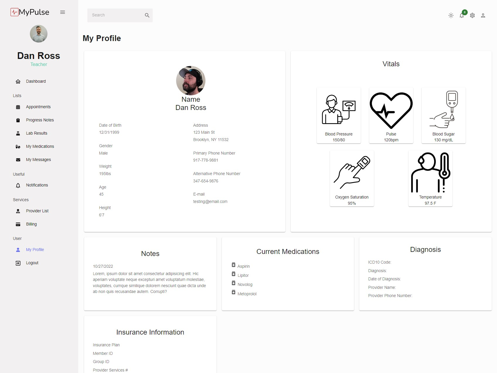
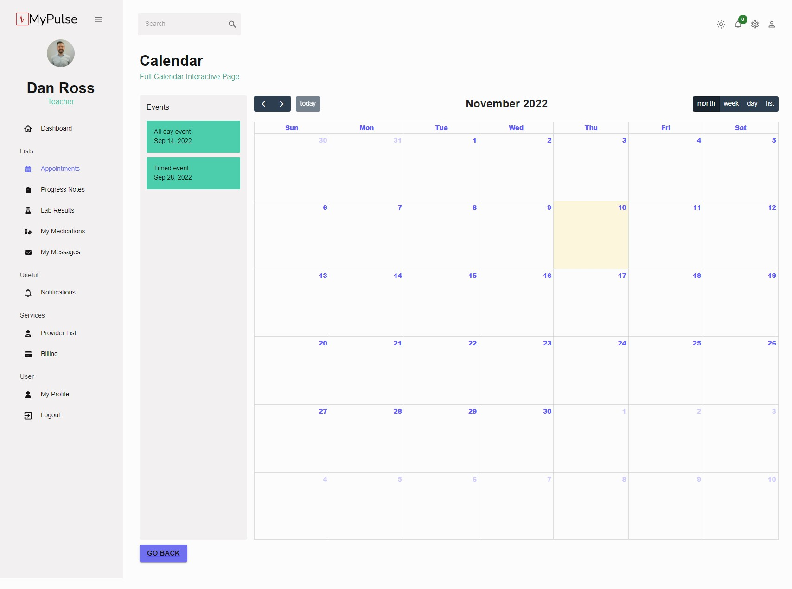
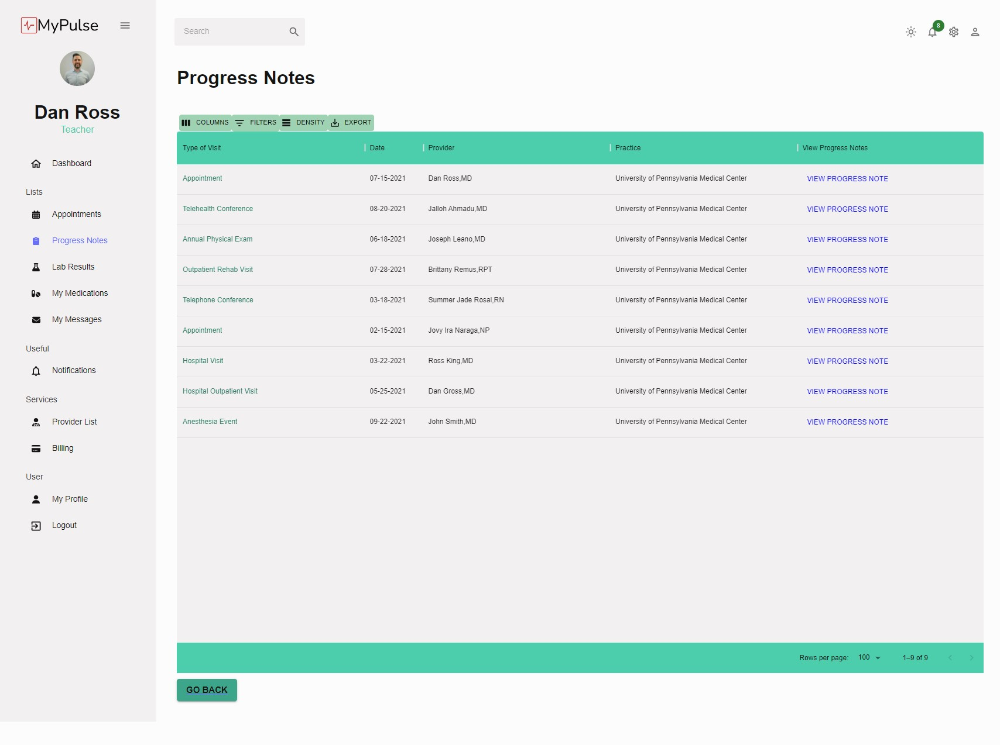

# MyPulse EHR

---

## Table of Contents

1. [Description](#description)
2. [Repository-Links](#repository-links)
3. [Screenshots](#screenshots)
4. [Links](#links)
5. [Deployment](#deployment)
6. [Contributing](#contributing)
7. [Authors](#authors)

---

## Description

This is our final group project for the UPENN Bootcamp. As a group, we were tasked to create an Interactive MERN Stack Single-Page Application. As a group, we have created an Electron Health Records application called MyPulse. An EHR focuses on the total health of the patient, going beyond standard clinical data collected in the provider’s office, and inclusive of a broader view on a patient’s care. EHRs are designed to reach out beyond the health organization that originally collects and compiles the information.

---

## Repository Links

**[The Tenant Site](/src/project-emr-frontend)**

This client facing React application is the portal that patients/clients will consume

**[The API](/src/project-emr-backend)**

This Node Express application powers all functionality on the tenant and admin sites. It's primary backing store is the MySQL database.

---

## Screenshots

---

## Links

- [Github](https://github.com/Summerjay0401/project-x-emr)
- [Trello](https://trello.com/b/xFDJDZFT/emr)

---

## Deployment

- [Heroku](#)

---

## Contributing

 - See [the contributing guide](/CONTRIBUTING.md) for details.

---

## Authors

- [@Summerjay0401](https://github.com/Summerjay0401)
- [@Jlnaraga](https://github.com/Jlnaraga)
- [@jdanleano](https://github.com/jdanleano)
- [@bremus124](https://github.com/bremus124)
- [@Ajalloh1](https://github.com/Ajalloh1)
